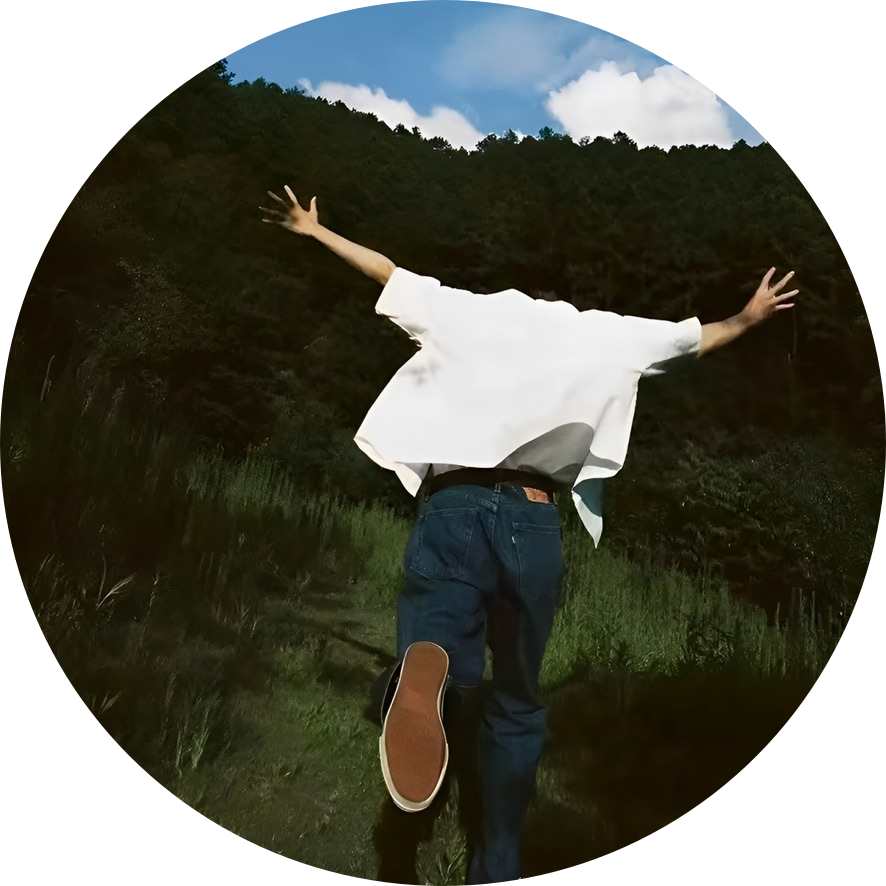

  

  <strong>Hi there, I'm ZeroAnon</strong> 👋

  前端开发者 → 认真生活的人

  
  
  
  
  

  “不做圣经里腐朽的诗集，要做禁书里最惊世骇俗的篇章”

  <a href="https://zeroanon.com">Blog</a> ·
  <a href="https://zeroanon.com/projects">Projects</a> ·
  <a href="https://zeroanon.com/interesting">Interesting</a> ·
  <a href="https://zeroanon.com/friends">Friends</a> ·
  <a href="https://zeroanon.com/myself/use-setting">Uses</a>

  <a href="https://github.com/zeroanonx">GitHub</a> ·
  <a href="mailto:2188817393@qq.com">Email</a> ·
  <a href="https://zeroanon.com/rss.xml">RSS</a>

---

<table>
  <tr>
    <td width="56%" valign="top">

### ABOUT

你好，我是 **ZeroAnon**，一个狂热的开源爱好者。

我很喜欢把脑海里的想法一点点做出来，这也是我持续写代码的动力来源。

我很喜欢音乐，音乐是我永恒的伴侣。

我像一条缝里挤出的野草，弯弯曲曲地向上生长。

这里是我开发和维护的一些 [项目](https://zeroanon.com/projects)，如果你愿意，也欢迎来提建议或者一起参与。

目前我在 **杭州** 参与一些有意思的项目，也一直在持续打磨自己的能力边界。

我也很喜欢分享知识和经验，这是我的 [工作环境清单](https://zeroanon.com/myself/use-setting)。

如果你也对这些方向感兴趣，我们可以一起喝杯咖啡，或者顺手做点有趣的东西。

> 朋友，不必理会他人过的怎么样，你始终要有一颗属于自己的心和精神世界不受影响。

  </td>
    <td width="44%" valign="top">

### SKILLS

  
  

  
  

**Core Frontend**

- Vue
- React
- Next.js
- Nuxt
- TypeScript
- Node.js

[查看更多技能 →](https://zeroanon.com/skills)

**当前关注**

我更关注知识分享、开源工具打磨，以及那些看起来克制、用起来顺手的界面体验。

  </td>
  </tr>
</table>

---

  Made with ❤️ by <a href="https://github.com/zeroanonx">zeroanon</a>

